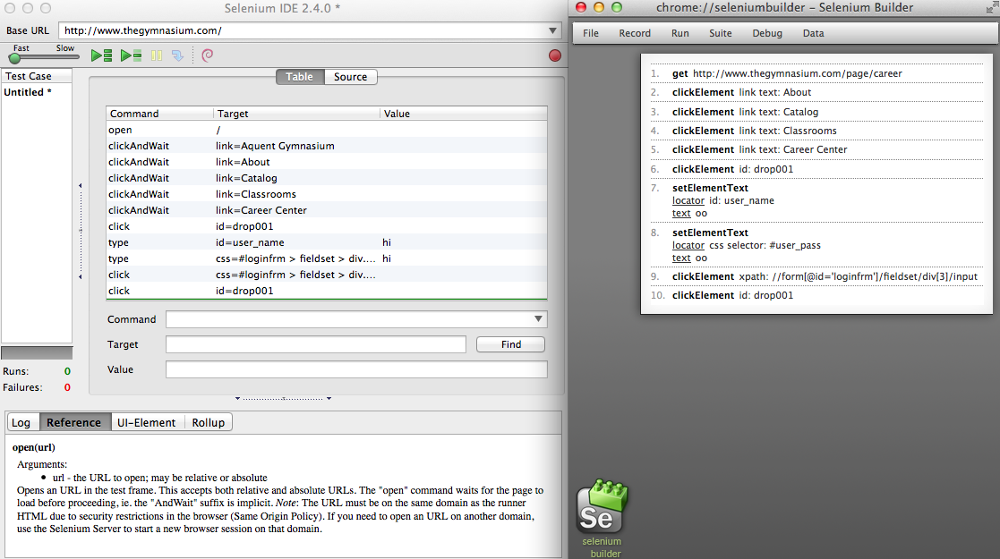

ruby_webdriver_example
======================

Simple example of ruby webdriver.

--

#### [Selenium IDE](http://www.seleniumhq.org/projects/ide/) vs [Selenium Builder](http://sebuilder.github.io/se-builder/)

I recommend builder.

